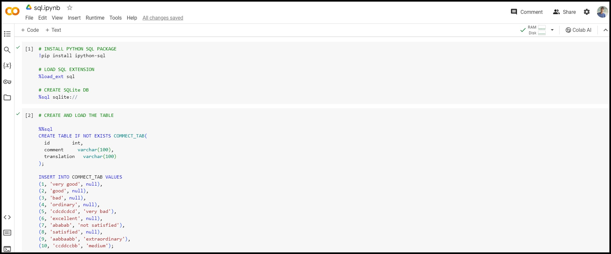

# Google Colab + ipython-sql

## About
This repository showcases the power of integrating Python and SQL within Google Colab notebooks using the ipython-sql package. If you're a data enthusiast looking to streamline your data workflow, you're in the right place!

## Overview
As a data engineer deeply immersed in Python, SQL, and cloud technologies, I've been exploring ways to maximize efficiency in my data projects. Google Colab has been my go-to platform for its powerful computing capabilities, but I found myself missing the seamless integration of SQL. That's where ipython-sql comes in!

## Features
- Execute SQL queries directly within Google Colab notebooks.
- Utilize SQLAlchemy URL connect strings for database connections.
- Compatible with other notebook platforms like Jupyter Notebook.

## How to Use
To get started, simply click on the notebook and open it in Google Colab. From there, you can make a copy of the notebook and run it in your own Colab environment.

## Connect with Me
If you have any questions or feedback, feel free to connect with me on [LinkedIn](https://www.linkedin.com/in/vighc).

Happy coding! 🚀
